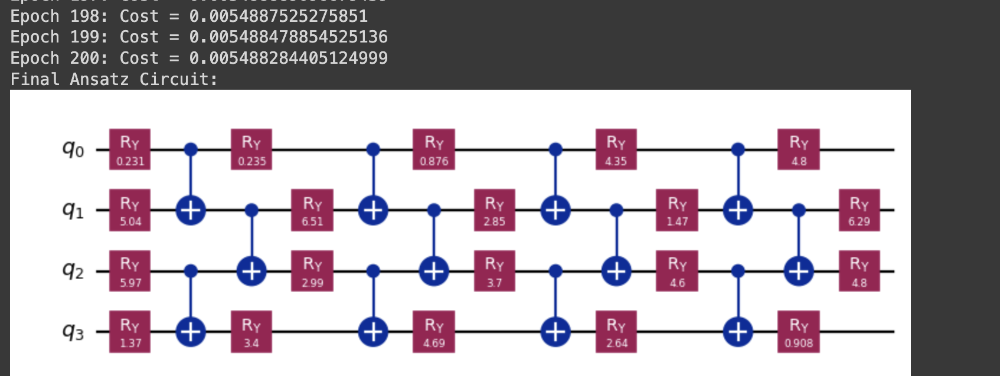

The code present in the main dot Pi file in this guitar propose a tree has been written as part of a submission for the QPoland hackathon under the QML track. The research paper used in reference for making this code is the Variational Quantum Linear Solver paper by Carlos Bravo-Prieto, Ryan LaRose, M. Cerezo, Yiğit Subaşı, Lukasz Cincio and Patrick J. Coles1. In this attempt to implement the research paper we have tried to implement two different ansatz. The first one is the general Variational Quantum Circuit ansatz which contains the rotation PauliY (RY) gate along with the control not (CNOT) gates between the wires. The second ansatz is the hardware efficient ansatz which contains RY gates along with the control Z operations. The circuit for the second ansatz is present in page 5 figure 3 of the referenced paper. The number of layers present in the circuit and the type of the answers being used can be easily changed by changing the input of the run_vqls function in the code. For the first ansatz the input should be "standard" and for the second ansatz, input should be "proposed_first". The images of the graphs showing the learning rate for the two different and census has been given below. In the paper there were four cost functions proposed. Among these we have used the Global cost function. For the generation of the matrix A which is the coefficient matrix for a given system of linear equations is being generated using the SparsePauliOp operator function provided by Qiskit.

Installation command:
```
!pip install pennylane qiskit torch matplotlib numpy scipy pylatexenc
```

After this the code can be run, after which the image of the final circuit is saved on the system with the name "final_circuit.png".

Comparison graphs:
The following graph is for the "standard" ansatz (the first one described above)


The following graph is for the "proposed_first" ansatz (the second one described above)

